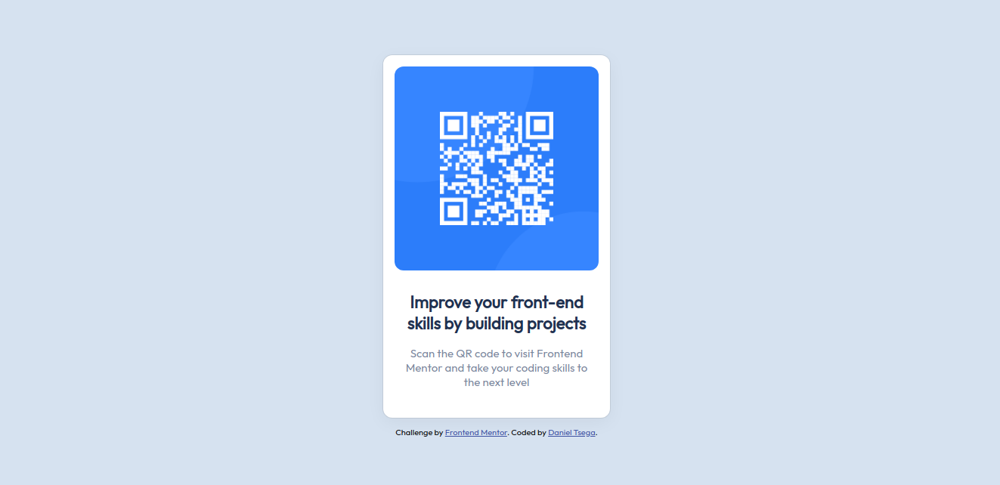

# Frontend Mentor - QR code component solution

This is a solution to the [QR code component challenge on Frontend Mentor](https://www.frontendmentor.io/challenges/qr-code-component-iux_sIO_H). Frontend Mentor challenges helps me improve my coding skills by building realistic projects. 

## Table of contents

- [Overview](#overview)
  - [Screenshot](#screenshot)
  - [Links](#links)
- [My process](#my-process)
  - [Built with](#built-with)
  - [What I learned](#what-i-learned)
- [Author](#author)

## Overview

### Screenshot




### Links

- Solution URL: [Add solution URL here](https://your-solution-url.com)
- Live Site URL: [Add live site URL here](https://your-live-site-url.com)

## My process

### Built with

- Semantic HTML5 markup
- CSS custom properties
- Flexbox
- Mobile-first workflow


### What I learned

In this project I learned all about implementing the basics knowledge I have on HTML and CSS, This project helped me to expand my experiance by tackling real life projects like this.


```html
<div class="main-txt">
        Improve your front-end skills by building projects
      </div>
```
```css
body {
  background-color: hsl(212, 45%, 89%);
  display: flex;
  flex-direction: column;
  justify-content: center;
  align-items: center;
}
```


## Author

- Frontend Mentor - [@DannySanchez6658](https://www.frontendmentor.io/profile/yourusername)


